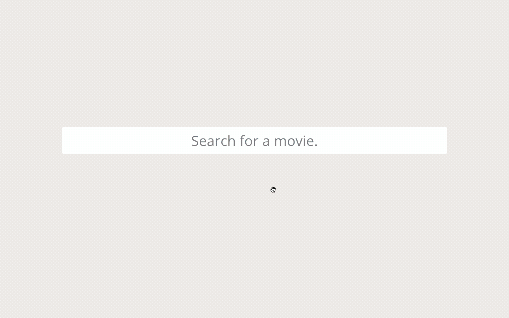

# Movie Search 

Allow users to search for movies by name through the OMDB API service. 

## Learning Objectives
* Develop a React web app using Redux and React Router
* Implement page animations
* Create continuous integration testing with Mocha and Nightmare

